# TT 425 

## Label Settings

### Main Label Settings

 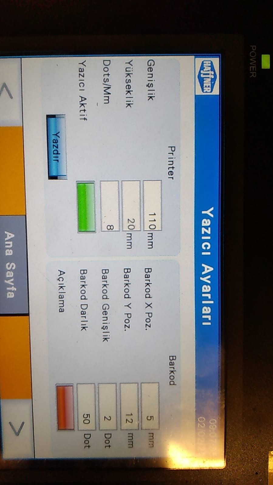

### Cutting No Settings

 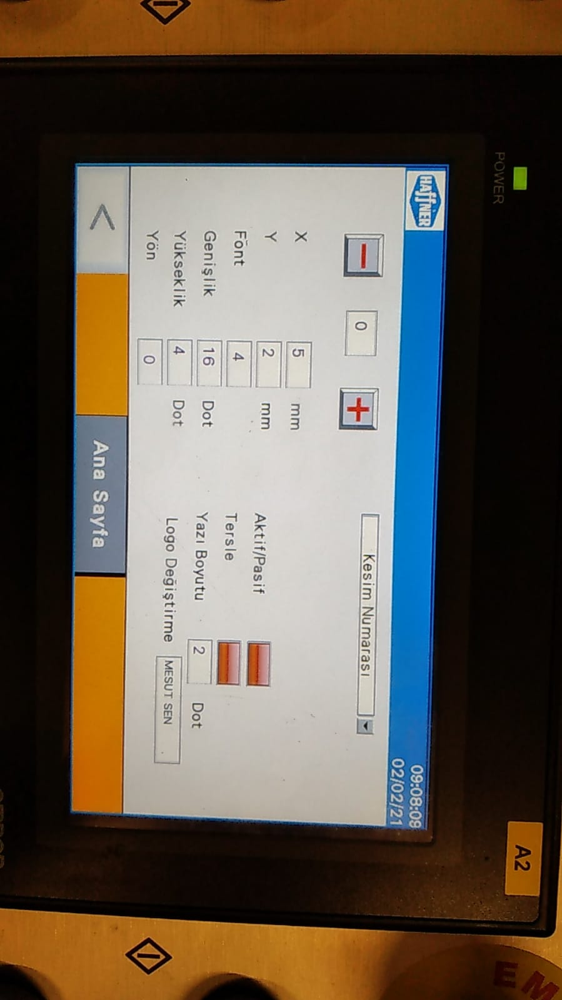

### Cutting Length Settings

 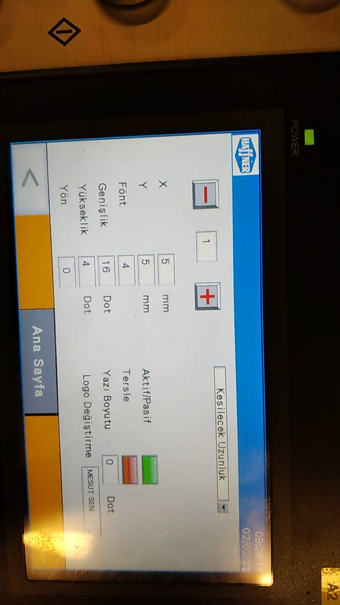

### Profile Code Settings

 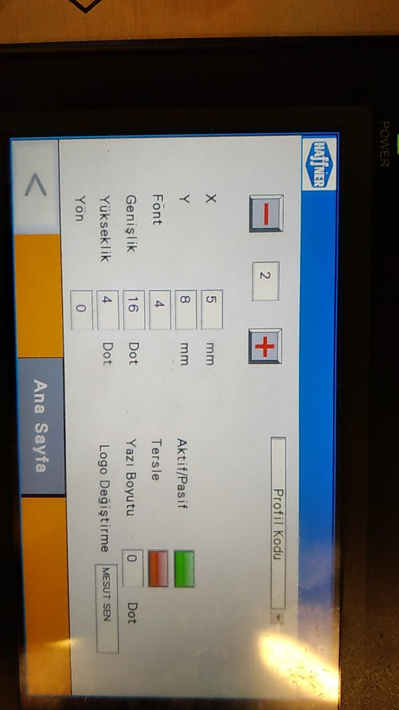

### Left Tilt Angle Settings

 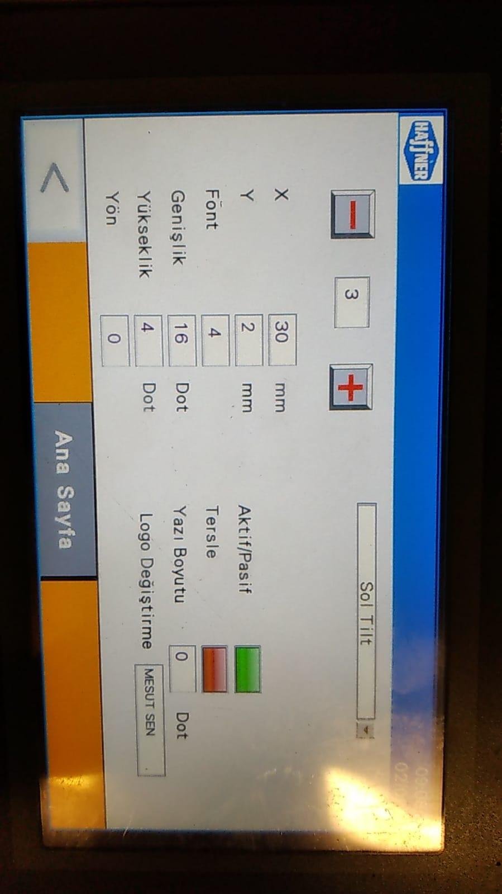

### Right Tilt Angle Settings

 

### Amount Settings

 

### Profile Height Settings

 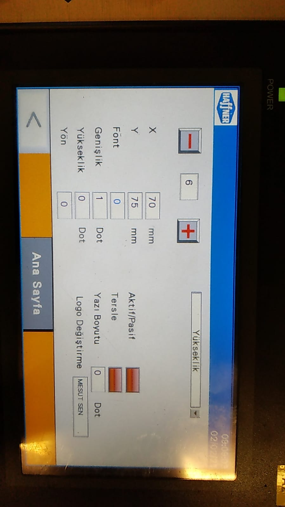

### Order No Settings

 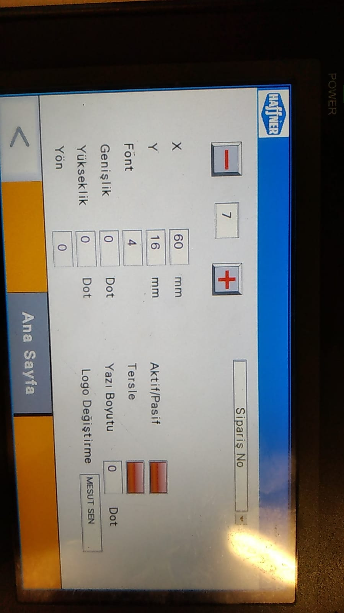

### POZ No Settings

 

### Assembly Settings

 

### Trolley / Car No Settings

 

### Box / Location No of Car Settings

 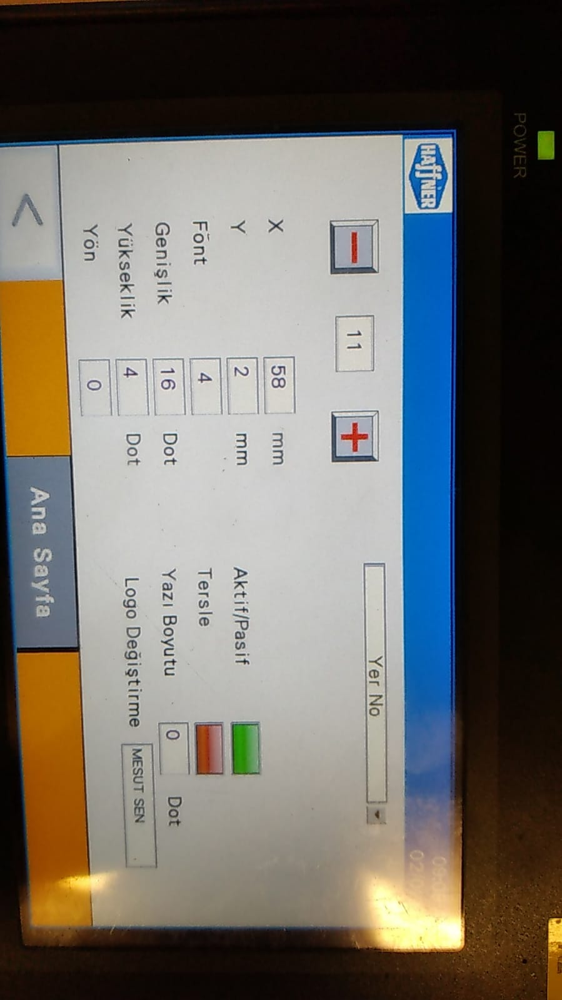

### Other Side Length Settings

 

### Color and Gasket Settings

 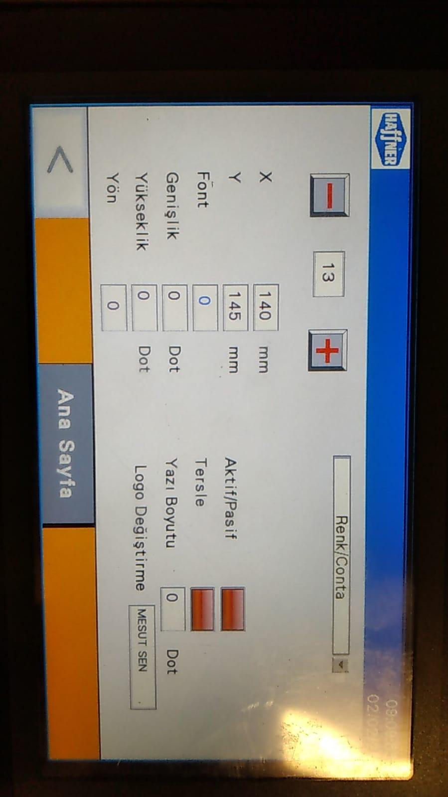

### Operation Settings

 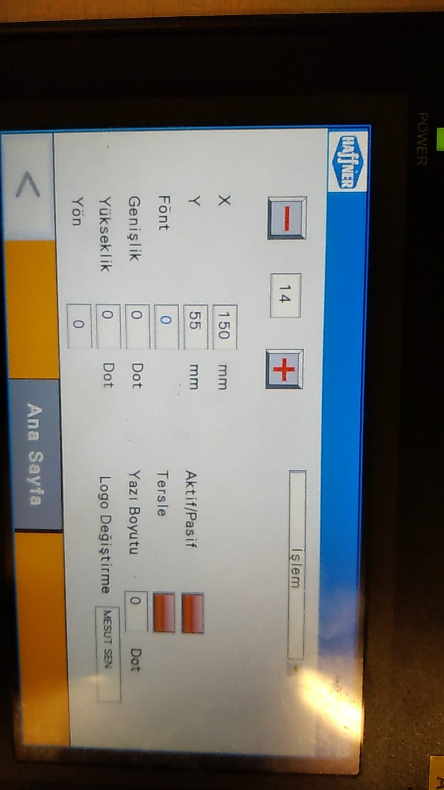

### Dealer Settings

 

### Left Pivot Angle Settings

 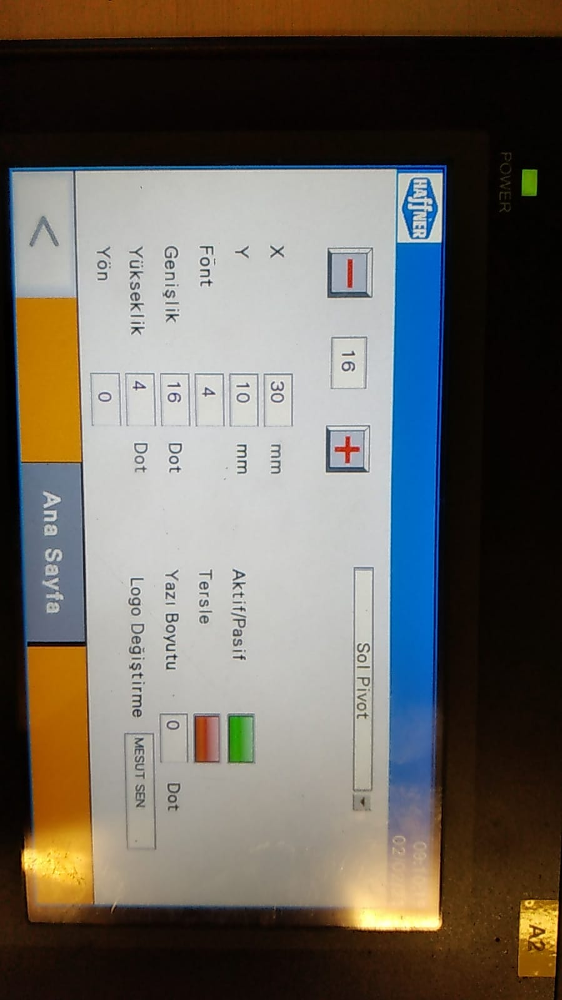

### Right Pivot Angle Settings

 

### Logo Settings

 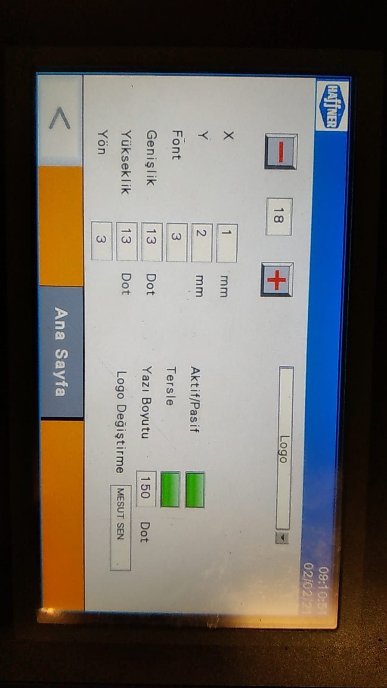
