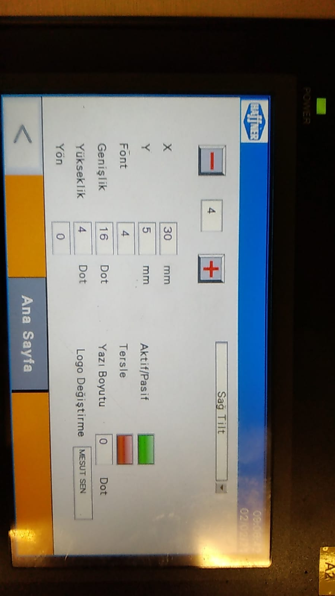
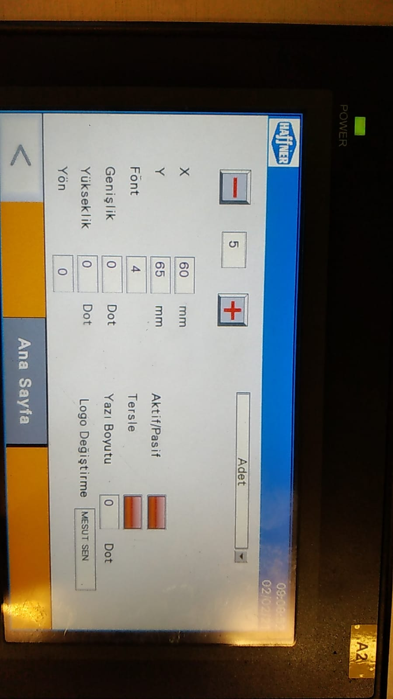
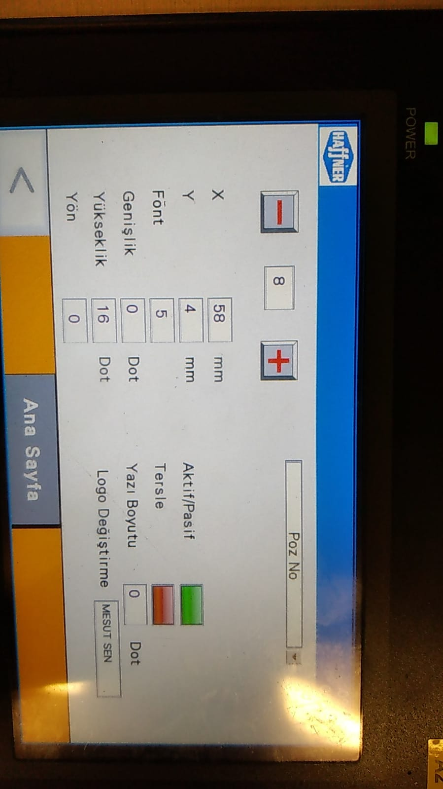
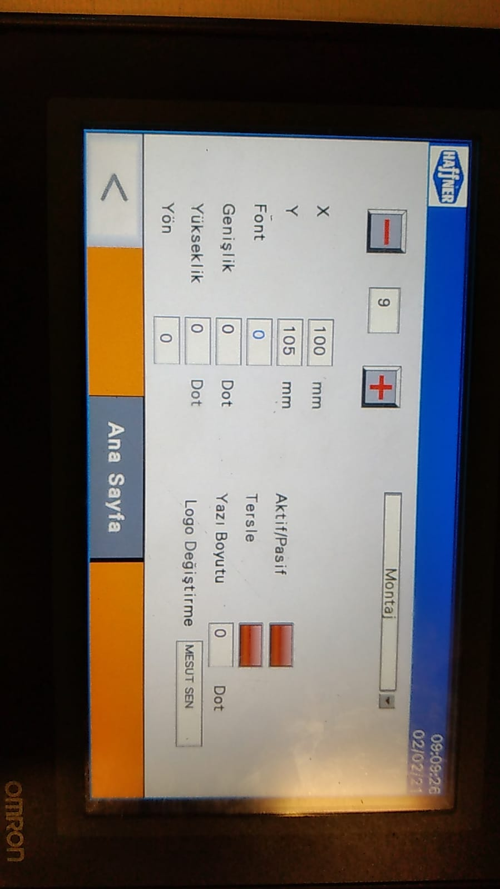
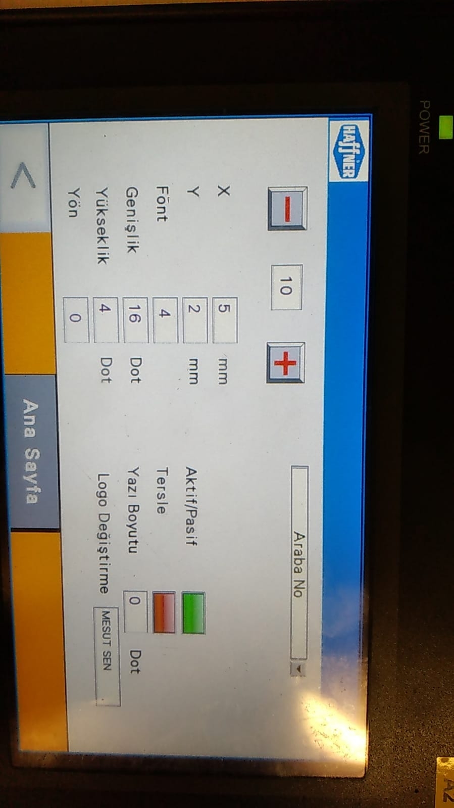
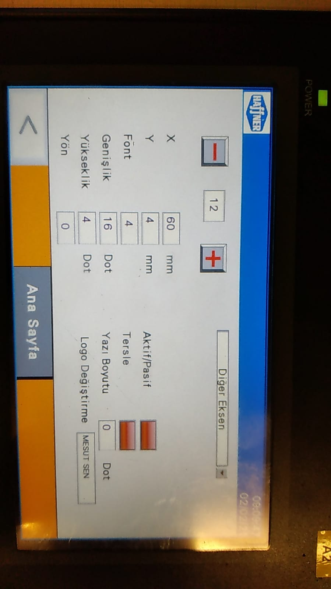
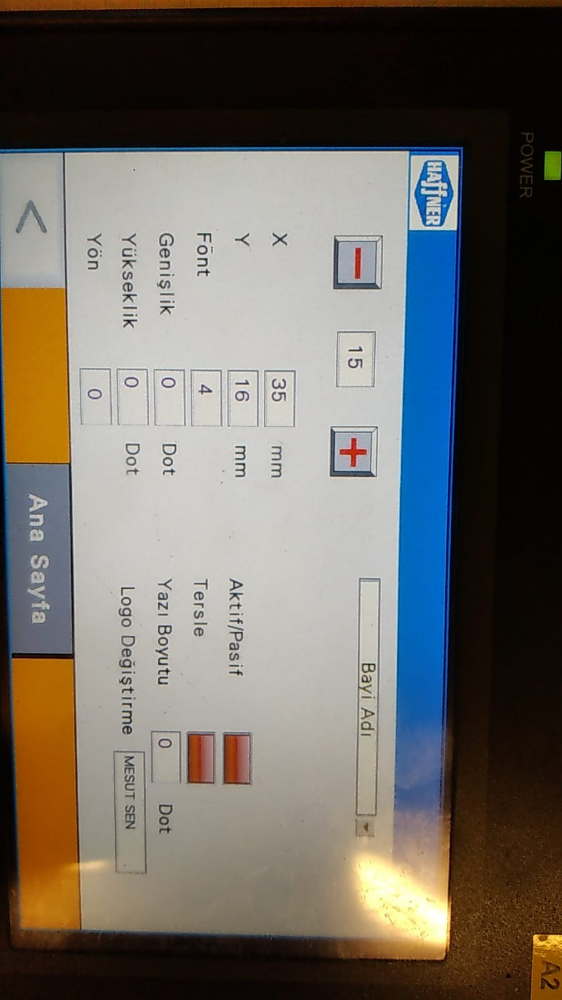
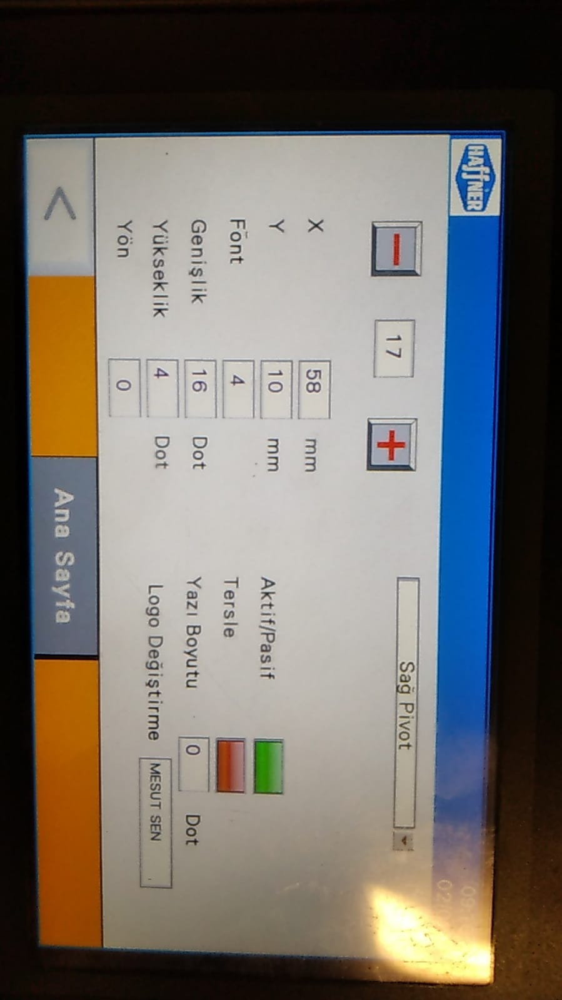

# TT 425 

## Etiket Ayarları

### Etiket Ana Ayarları

 

### Kesim Numarası

 

### Kesim Uzunluk

 

### Profil Kodu

 

### Sol Tilt Açısı

 

### Sağ Tilt Açısı

 

### Adet

 

### Profil Yükseklik

 

### Sipariş No

 

### POZ No

 

### Montaj

 

### Araba No

 

### Arabadaki Yer No

 

### Diğer Kenar Uzunluğu

 

### Renk ve Conta

 

### İşlem 

 

### Bayii

 

### Sol Pivot Açısı

 

### Sağ Pivot Açısı

 

### Logo 

 
